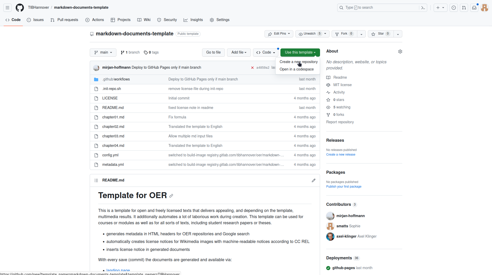
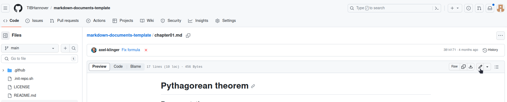
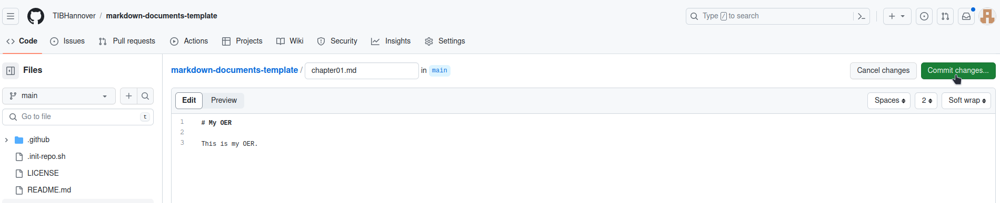
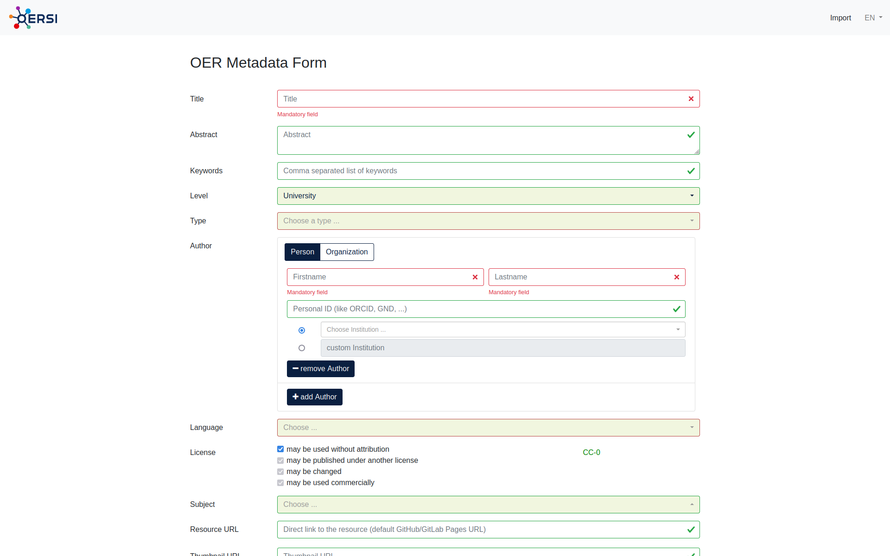
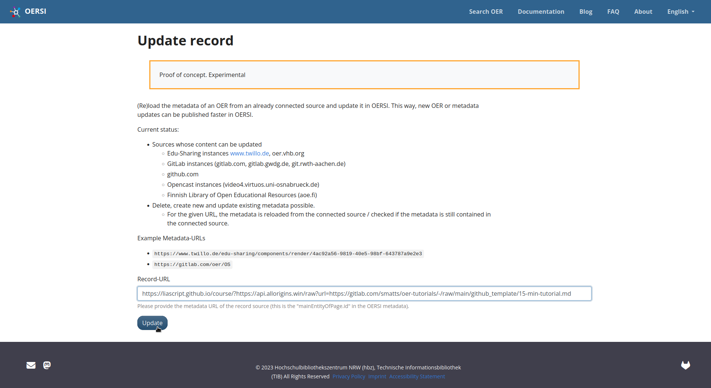

# Create and publish OER with GitHub
We believe that open educational resources can be created using tools the open source community has been successfully using for many years now.
This tutorial guides you through the creation of open educational resources (OER) with GitHub. Using our GitHub template, you can easily create and publish your own OER in just a few minutes.

**What's in this tutorial:**

* [Quick Start (< 5 minutes)](#quick-start)
* [Step-by-step (< 10 minutes)](#requirements)

    * [Requirements](#requirements)

  * [Create a project](#create-a-project)
  * [Enable automatic generation](#enable-automatic-generation)
  * [Upload your own content](#upload-content)
  * [Update the metadata](#update-the-metadata)    
  * [Configuration options](#configuration-options)
  * [Insert the course in OERSI](#insert-your-coursedocument-in-oersi)

> After completing this tutorial, you will have an automatically generated OER with your own content and metadata, published on GitHub for free and ready to be put into our OER search index [OERSI](https://oersi.org).

## Quick Start
<section>

> If you want to get started really quickly, you can follow this quick start tutorial and create a simple OER within just a few minutes.

### 1. Create a GitHub account, if you don't have one yet
> As we will host our OER on [GitHub](https://github.com/), a free GitHub account is required.

If you do not have an account yet, go to GitHub's sign up page and create a free account: [https://github.com/signup](https://github.com/signup).

Afterwards, log into your account.

### 2. Create your project
> Create the place where your OER lies.

Go to the [Markdown Documents Template](https://github.com/TIBHannover/markdown-documents-template) and click on the green **Use this template** button, then on **Create a new repository**. This generated your own project (called `repository`).
Assign the repository's owner to yourself (or to a group of your choice, if you are a member of one) and give it a short, but meaningful name that describes your OER. This name will also be the used for the URL to your OER. Optionally add a description.
Make sure that the repository is set to **public**.
Lastly, confirm by clicking on **Create repository from template**.



### 3. Fill the project with your content

> Now that you have your own project/repository, you can fill it with your own content.

Currently, you have the template's dummy data in your repository. You can edit a file by clicking on the file and then on the edit button. The files you should edit are:

* `chapter01.md`
* `chapter02.md`
* `chapter03.md`
* `chapter04.md`

You can start by edititing `chapter01.md`. Click on the file, the in the top right corner, click on the pen symbol ("Edit this file"). You can delete the file's content and start writing something of your own.




Now, in the top right corner, click on the green "Commit changes..." button. Write a short message on what you have changed ("Commit message"), if you want a longer description, and now click on the green "Commit changes" button.




You can also choose to create or delete files. If you do not want the four chapter files that were created by the template, you can click on the file, click on the three dots on the top right of the file, and then on "Delete file". To upload files, you can click on the "Add file" button in your repository.

### 4. Add your metadata
Go to our [Metadata Generator]() and insert the metadata that describes your OER. In the top right corner, you have the option to switch the language between **German** ("DE") and **English** ("EN").



Once you are done, click on the "Generate" button in the bottom of the page. The metadata is now generated in a format our template understands. Now copy everything to your clipboard. For this, you can click on "Copy".


In your repository, click on the `metadata.yml` file and then on the pen symbol ("Edit this file") to edit the file. Delete the file's contents and paste the metadata from your clipboard. Now click on the green "Commit changes..." button and confirm with "Commit changes".

Now at the bottom of the page, you can click on `Generate`. This generates the metadata in the correct format. You can then copy the output to your clipboard either by using the `Copy` button, or by selecting the whole text (`Ctrl + A`) and copying it (`Ctrl + C`).

### 5. Generate the OER
> The automatic generation will take your content and generate different output formats.

Lastly, enable the automatic generation of your OER. To do this, go to the project's `Settings` -> `Pages` and in `Build and Development` set the source to `GitHub Actions`. After this, you can head to the `Actions` tab and click on the newest workflow run. If the worklow already ran, you will find that it failed. This happened because the Pages were not enabled yet. In this case, click on re-run jobs. Otherwise, wait until the jobs have finished. The generated documents are now created.

### Done!
At the front page of your repository, inside the `README.md` content, there are several links you can use to view your generated documents. Click on the `landing page` link to view a page that lists metadata about your OER and supplies several links to different output formats (like a web version, a pdf version, ...).

> You can insert your OER into the OER search index [oersi.org](https://oersi.org). To learn how to do this, head over to the section [Insert the course in OERSI](#insert-your-coursedocument-in-oersi).

</section>

## Step by step tutorial
The step by step tutorial consists of the following steps, which you can click through either on the sidebar, using the arrows on the bottom or simply using the arrow keys on your keyboard.

* [Requirements](#requirements)
* [Create a project](#create-a-project)
* [Enable automatic generation](#enable-automatic-generation)
* [Upload your own content](#upload-content)
* [Update the metadata](#update-the-metadata)    
* [Configuration options](#configuration-options)
* [Insert the course in OERSI](#insert-your-coursedocument-in-oersi)

### Requirements

<section>

> For this tutorial, **you will need a GitHub account**. It is also recommended to **get to know Markdown**, a markup language which can create formatted text using only plain-text, since Markdown is used to write and format your content.
>
> If you already have a GitHub account and know basic markdown syntax, you can skip this part and directly go do [Create a project](#create-a-project).

### Create a GitHub account

If you don't have an account yet, go to [GitHub](https://github.com/) and sign up. Confirm your e-mail address and log in.

### Markdown

From Matt Cone's [Markdown guide](https://www.markdownguide.org/getting-started/):

>Markdown is a lightweight markup language that you can use to add formatting elements to plaintext text documents. Created by John Gruber in 2004, Markdown is now one of the world’s most popular markup languages.
>
>Using Markdown is different than using a WYSIWYG editor. In an application like Microsoft Word, you click buttons to format words and phrases, and the changes are visible immediately. Markdown isn’t like that. When you create a Markdown-formatted file, you add Markdown syntax to the text to indicate which words and phrases should look different.
>
>For example, to denote a heading, you add a number sign before it (e.g., # Heading One). Or to make a phrase bold, you add two asterisks before and after it (e.g., **this text is bold**). It may take a while to get used to seeing Markdown syntax in your text, especially if you’re accustomed to WYSIWYG applications.

If you want to learn about Markdown, what it is and what you can do with it, you can read this guide: [Get Started](https://www.markdownguide.org/getting-started/).

To see basic formatting options, check out the [Cheat Sheet](https://www.markdownguide.org/cheat-sheet/). More basic syntax can be found in the [Basic Syntax](https://www.markdownguide.org/basic-syntax/) guide.

</section>

### Create a project

<section>

> The place where you will put your OER is called a `repository`. You can think of it as a project where all your files are located.

Once you are logged into GitHub, go to the [TIB Hannover markdown documents template repository](https://github.com/TIBHannover/markdown-documents-template) and click on "Use this template" -> "Create a new repository".

Assign the repository to the correct owner and give it a short but meaningful name. The name will be the URL of the repository as well. You can add a description if you want. Now make sure that the visibility of the repository is set to **public**. This has two main reasons: firstly, so people can see your OER, and secondly to use the GitHub pages functionality which we will get to later. Lastly, confim by clicking on "Create repository from template".

Now, a new repository is initialized for you containing the contents from the template.

#### Video tutorial
!?[Tutorial as video](videos/create-from-template.mp4)

</section>

### Enable automatic generation

<section>

> The automatic generation will take your content (everything inside the `Markdown` files, so those ending with `.md`) and generate different output formats. For example, these include a **web page** and a **pdf** version of your OER and are publicly accessible. This generation is done each time you change something in your repository, so your content will always be up to date.

In order to generate the different output formats for your OER, go to the project's `Settings` -> `Pages` and in `Build and Development` set the source to `GitHub Actions`. After this, you can head to the `Actions` tab and click on the newest workflow run. If the worklow already ran, you will find that it failed. This happened because the Pages were not enabled yet. In this case, click on re-run jobs. Otherwise, wait until the jobs have finished. The pages and documents are now created. They can be accessed by the link that appeared under the `deploy` step.

Congratulations, you now have a complete course/document that you can make your own!

#### What are Actions?

> An `Action` is something that GitHub can execute with every commit (save) you make to the repository. This includes the generation of documents or pages, which we are using in this tutorial.
>
> A more detailed explanation of GitHub Actions can be found here: [Understanding GitHub Actions](https://docs.github.com/en/actions/learn-github-actions/understanding-github-actions).

#### What are Pages?
> A `Page` is a public website hosted by GitHub. We can use GitHub Actions to automatically generate our website and then host it on GitHub Pages for everyone to see. You can either host your site for free on `your-username.github.io` or use your own costum domain.
>
>More information on GitHub Pages can be found here: [About GitHub Pages](https://docs.github.com/en/pages/getting-started-with-github-pages/about-github-pages).

### Video tutorial
!?[Actions and Pages](videos/pages.mp4)

</section>

### Upload content

<section>

> Currently, there is still dummy data inside your repository. The next step is to replace this dummy data with your actual OER.

### How and where to upload your own content

In the repository, you can find four `chapterXX.md` files. These are our dummy content files.
You can either edit or delete them. You can of course create new files, too.
If you create new files, make sure that they end with the correct file format ending `.md`, so `filename.md`.

### Ensuring the correct order

By default, the automatic generator will look for all markdown files (so those ending with `.md`) in the top-level of the repository except for the `README.md` file, order them alphabetically and create the different output formats with them. If you want to upload multiple content files, you will either have to:

* adapt the names of the files so that they will be ordered correctly alphabetically, for example:

  * `01_Introduction.md`
  * `02_Some-Chapter.md`
  * ...
* or you will have to list every file in the correct order in `config.yml`. You can learn more about that in the [Configuration options](#configuration-options) section.

</section>

### Update the metadata

<section>

> Metadata is the data describing your OER. This includes information like the title, author, license and much more. If you don't supply metadata with your repository, it is unclear what your OER is about, who it is from, if and how your OER can be used and so on. This is why we have a `metadata.yml` file in our repository. This file lets us include the information about the OER directly in the repository. This is also necessary for inserting your OER into a search index like [OERSI](https://oersi.org). This section shows how to replace the dummy metadata in the repository with the correct metadata describing your OER.

Perhaps the easiest way to generate your own metadata for your repository in the correct format is to use the [OERSI metadata generator](https://oersi.gitlab.io/metadata-form/metadata-generator.html) and fill out at least all required fields, but try to fill out as much as you can.


Now at the bottom of the page, you can click on `Generate`. This generates the metadata in the correct format. You can then copy the output to your clipboard either by using the `Copy` button, or by selecting the whole text (`Ctrl + A`) and copying it (`Ctrl + C`).


In your GitHub repository, edit the `metadata.yml` file. Now delete the whole file content and paste the output of the generator.
To save, click on `Commit changes...` in the top right corner. Confirm by clicking on `Commit changes`.

#### Video: Update the metadata
!?[Update the metadata](videos/metadata-placeholder.mp4)

</section>

### Configuration options

<section>

> In the repository, there is a file called `config.yml`. This gives you some configuration options concerning the automatic generation of your OER, like the order of your content.

In the top level of the repository, there is a file named `config.yml`. It includes configuration for these four things:

* `output`: state the output formats that you want to be automatically generated
* `generate_landingpage`: decide whether or not to create a landing page
* `content_files`: define the order of your content files
* `generate_reuse_note`: decide whether or not to generate a reuse note on the generated documents

#### Editing this file

As you are editing this file, you have to consider the format of this file. This file is a `yaml` file. This file has a specific structure you have to follow, or else the automatic generator will not work.

As you can see when opening the file, the structure looks like this:

``` yaml
output:
  - format: asciidoc
  - format: epub
  - format: html
  - format: pdf
generate_landingpage: true
# content_files:  # uncomment this to set the order of the documents (default alphabetical)
#   - chapter01.md
#   - chapter02.md
#   - chapter03.md
#   - chapter04.md
generate_reuse_note: true
```

So we have to consider the identation and the correct symbols to use. If we want to use the `content_files` option, we uncomment this by deleting the `#` before each line and removing the residual spaces:

``` yaml
output:
  - format: asciidoc
  - format: epub
  - format: html
  - format: pdf
generate_landingpage: true
content_files:  # uncomment this to set the order of the documents (default alphabetical)
  - chapter01.md
  - chapter02.md
  - chapter03.md
  - chapter04.md
generate_reuse_note: true
```

The dashes (`-`) have to start with two spaces before the dash and then one space after the dash.
Basically, just make sure the number of spaces is consistent throughout the whole file.

#### Video tutorial
!?[Config file explained](videos/config.mp4)

</section>

### Insert your OER in OERSI
> Let's assume that...
>
> * you have put your whole completed course or document content into the repository, and it's either ordered alphabetically or you have defined the correct order in the `config.yml` file,
> * you have enabled the `Pages` for `GitHub Actions` and there are no errors during Action execution, thus you have a published Page that represents the current version of your repository,
> * you have entered full and correct metadata, ensuring the license is correct and you are not violating another work's license with this license,
> * inside your `metadata.yml` file, you have set your creative work status to `Published`,
>
> **then you are ready to put your OER into OERSI!**

For that, head to OERSI's [record updater](https://oersi.org/resources/pages/de/record_update/) and paste the URL to your GitHub Page.



### Done!
Congratulations, you did it! Now go search you course on [oersi.org](https://oersi.org)!

If you want to learn more about what you can do with this template, you can continue with the advanced tutorial.