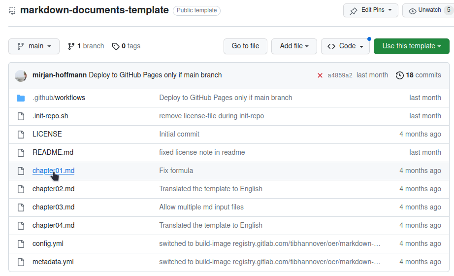
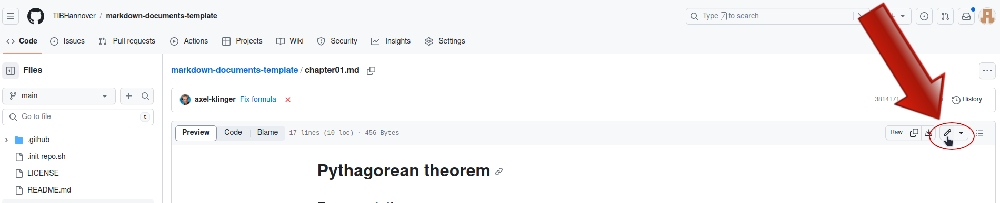
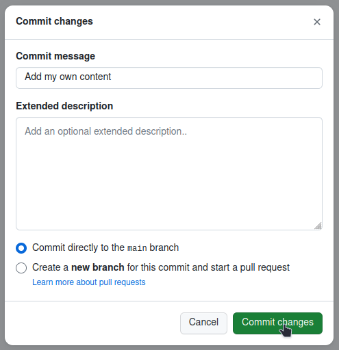
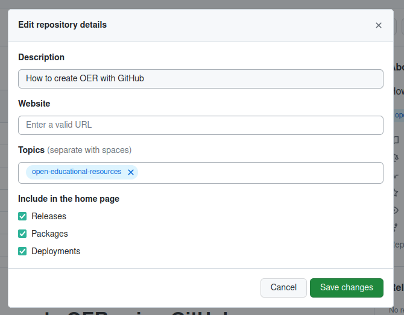

# Create and publish OER with GitHub
We believe that open educational resources can be created using tools the open source community has been successfully using for many years now.
This tutorial guides you through the creation of open educational resources (OER) with GitHub. Using our GitHub template, you can easily create and publish your own OER in just a few minutes.

**What's in this tutorial:**

* [Quick Start (< 5 minutes)](#quick-start)
* [Step-by-step (< 10 minutes)](#requirements)

    * [Requirements](#requirements)

  * [Create a project](#create-a-project)
  * [Generate output](#generate-output)
  * [Fill with your own content](#fill-with-content)
  * [Add your metadata](#add-your-metadata)
  * [Insert into OERSI](#insert-your-oer-in-oersi)
* [Reference](#reference)

  * [Configuration options](#configuration-options)
  * [Markdown](#markdown-1)
  * [Git](#git)
  * [Working offline](#working-offline)
  * [Immediate update in OERSI](#immediate-update-in-oersi)
  * [Different formats](#different-formats)

> After completing this tutorial, you will have an automatically generated OER with your own content and metadata, published on GitHub for free and ready to be put into our OER search index [OERSI](https://oersi.org).

## Quick Start
<section>

> If you want to get started really quickly, you can follow this quick start tutorial and create a simple OER within just a few minutes.

### 1. Create a GitHub account, if you don't have one yet
> As we will host our OER on [GitHub](https://github.com/), a free GitHub account is required.

If you do not have an account yet, go to GitHub's sign up page and create a free account: [https://github.com/signup](https://github.com/signup).

Afterwards, log into your account.

### 2. Create your project
> Create the place where your OER lies.

Go to the [Markdown Documents Template](https://github.com/TIBHannover/markdown-documents-template) and click on the green **Use this template** button, then on **Create a new repository**. This generated your own project (called `repository`).
Assign the repository's owner to yourself (or to a group of your choice, if you are a member of one) and give it a short, but meaningful name that describes your OER. This name will also be the used for the URL to your OER. Optionally add a description.
Make sure that the repository is set to **public**.
Lastly, confirm by clicking on **Create repository from template**.

!?[Create repository from template](videos/create-from-template.mp4)

### 3. Fill the project with your content

> Now that you have your own project/repository, you can fill it with your own content.

Currently, you have the template's dummy data in your repository. You can edit a file by clicking on the file and then on the edit button. The files you should edit are:

* `chapter01.md`
* `chapter02.md`
* `chapter03.md`
* `chapter04.md`

You can start by edititing `chapter01.md`. Click on the file, the in the top right corner, click on the pen symbol ("Edit this file"). You can delete the file's content and start writing something of your own.

Now, in the top right corner, click on the green "Commit changes..." button. Write a short message on what you have changed ("Commit message"), if you want a longer description, and now click on the green "Commit changes" button.

You can also choose to create or delete files. If you do not want the four chapter files that were created by the template, you can click on the file, click on the three dots on the top right of the file, and then on "Delete file". To upload files, you can click on the "Add file" button in your repository.

### 4. Generate the OER
> The automatic generation will take your content and generate different output formats.

Lastly, enable the automatic generation of your OER. To do this, go to the project's `Settings` -> `Pages` and in `Build and Development` set the source to `GitHub Actions`. After this, you can head to the `Actions` tab and click on the newest workflow run. If the worklow already ran, you will find that it failed. This happened because the Pages were not enabled yet. In this case, click on re-run jobs. Otherwise, wait until the jobs have finished. The generated documents are now created.

!?[Pages](videos/pages.mp4)

### 5. Add your metadata
Go to our [Metadata Generator]() and insert the metadata that describes your OER. In the top right corner, you have the option to switch the language between **German** ("DE") and **English** ("EN").

Once you are done, click on the "Generate" button in the bottom of the page. The metadata is now generated in a format our template understands. Now copy everything to your clipboard. For this, you can click on "Copy".

In your repository, click on the `metadata.yml` file and then on the pen symbol ("Edit this file") to edit the file. Delete the file's contents and paste the metadata from your clipboard. Now click on the green "Commit changes..." button and confirm with "Commit changes".

Now at the bottom of the page, you can click on `Generate`. This generates the metadata in the correct format. You can then copy the output to your clipboard either by using the `Copy` button, or by selecting the whole text (`Ctrl + A`) and copying it (`Ctrl + C`).

!?[Add metadata](videos/metadata-placeholder.mp4)

### Done!
At the front page of your repository, inside the `README.md` content, there are several links you can use to view your generated documents. Click on the `landing page` link to view a page that lists metadata about your OER and supplies several links to different output formats (like a web version, a pdf version, ...).

> To insert your OER into the OER search index [oersi.org](https://oersi.org), head to the `About` section in the index of your repository, click on the settings symbol and add `open-educational-resources` to `Topics`. Your course will be indexed at night and appear on the next day.

</section>

## Step by step tutorial
The step by step tutorial consists of the following steps, which you can click through either on the sidebar, using the arrows on the bottom or simply using the arrow keys on your keyboard.

* [Requirements](#requirements)
* [Create a project](#create-a-project)
* [Generate Output](#generate-output)
* [Fill with your own content](#fill-with-content)
* [Add your metadata](#add-your-metadata)
* [Configuration options](#configuration-options)
* [Insert into OERSI](#insert-your-oer-in-oersi)

### Requirements

<section>

> For this tutorial, **you will need a GitHub account**. It is also recommended to **get to know Markdown**, a markup language which can create formatted text using only plain-text, since Markdown is used to write and format your content.
>
> If you already have a GitHub account and know basic markdown syntax, you can skip this part and directly go do [Create a project](#create-a-project).

### Create a GitHub account

If you don't have an account yet, go to [GitHub](https://github.com/) and sign up. Confirm your e-mail address and log in.

### Markdown

From Matt Cone's [Markdown guide](https://www.markdownguide.org/getting-started/):

>Markdown is a lightweight markup language that you can use to add formatting elements to plaintext text documents. Created by John Gruber in 2004, Markdown is now one of the world’s most popular markup languages.
>
>Using Markdown is different than using a WYSIWYG editor. In an application like Microsoft Word, you click buttons to format words and phrases, and the changes are visible immediately. Markdown isn’t like that. When you create a Markdown-formatted file, you add Markdown syntax to the text to indicate which words and phrases should look different.
>
>For example, to denote a heading, you add a number sign before it (e.g., # Heading One). Or to make a phrase bold, you add two asterisks before and after it (e.g., **this text is bold**). It may take a while to get used to seeing Markdown syntax in your text, especially if you’re accustomed to WYSIWYG applications.

If you want to learn about Markdown, what it is and what you can do with it, you can read this guide: [Get Started](https://www.markdownguide.org/getting-started/).

To see basic formatting options, check out the [Cheat Sheet](https://www.markdownguide.org/cheat-sheet/). More basic syntax can be found in the [Basic Syntax](https://www.markdownguide.org/basic-syntax/) guide.

Some of the basic Markdown syntax is shown in the reference part of this tutorial: [Reference: Markdown](#markdown-1).

</section>

### Create a project

<section>

> The place where you will put your OER is called a `repository`. You can think of it as a project where all your files are located.

Once you are logged into GitHub, go to the [TIB Hannover markdown documents template repository](https://github.com/TIBHannover/markdown-documents-template) and click on "Use this template" -> "Create a new repository".


Assign the repository to the correct owner and give it a short but meaningful name. The name will be the URL of the repository as well. You can add a description if you want. Now make sure that the visibility of the repository is set to **public**. This has two main reasons: firstly, so people can see your OER, and secondly to use the GitHub pages functionality which we will get to later. Lastly, confim by clicking on "Create repository from template".

Now, a new repository is initialized for you containing the contents from the template.

#### Video tutorial
!?[Tutorial as video](videos/create-from-template.mp4)

</section>

### Generate output

<section>

> The automatic generation will take your content (everything inside the `Markdown` files, so those ending with `.md`) and generate different output formats. For example, these include a **web page** and a **pdf** version of your OER and are publicly accessible. This generation is done each time you change something in your repository, so your content will always be up to date.

In order to generate the different output formats for your OER, go to the project's `Settings` -> `Pages` and in `Build and Development` set the source to `GitHub Actions`. After this, you can head to the `Actions` tab and click on the newest workflow run. If the worklow already ran, you will find that it failed. This happened because the Pages were not enabled yet. In this case, click on re-run jobs. Otherwise, wait until the jobs have finished. The pages and documents are now created. They can be accessed by the link that appeared under the `deploy` step.

Congratulations, you now have a complete course/document that you can make your own!

#### What are Actions?

> An `Action` is something that GitHub can execute with every commit (save) you make to the repository. This includes the generation of documents or pages, which we are using in this tutorial.
>
> A more detailed explanation of GitHub Actions can be found here: [Understanding GitHub Actions](https://docs.github.com/en/actions/learn-github-actions/understanding-github-actions).

#### What are Pages?
> A `Page` is a public website hosted by GitHub. We can use GitHub Actions to automatically generate our website and then host it on GitHub Pages for everyone to see. You can either host your site for free on `your-username.github.io` or use your own costum domain.
>
>More information on GitHub Pages can be found here: [About GitHub Pages](https://docs.github.com/en/pages/getting-started-with-github-pages/about-github-pages).

### Video tutorial
!?[Actions and Pages](videos/pages.mp4)

</section>

### Fill with content

<section>

> Currently, there is still dummy data inside your repository. The next step is to replace this dummy data with your actual OER.

### How and where to upload your own content

In the repository, you can find four `chapterXX.md` files. These are our dummy content files.
You can either edit or delete them. You can of course create new files, too.
If you create new files, make sure that they end with the correct file format ending `.md`, so `filename.md`.

To edit a file, click on the file name in the index of your repository.



Then, in the top right corner of the file, click on the pen button to edit the file.



Now, you can replace the content with your own. Add as much as you like.
The file is a `Markdown` file, so you should write your content using this markup language.
You can find more about Markdown in the [Markdown section](#markdown-1) in the reference part of this tutorial.

Once you are done, you can save your changes by clicking on the green `Commit changes...` button in the top right corner.


Add a meaningful but short commit message, which is a message describing the changes you have made, and optionally a longer description.
Then confirm by clicking the green `Commit changes` button.



### Ensuring the correct order

By default, the automatic generator will look for all Markdown files (so those ending with `.md`) in the top-level of the repository except for the `README.md` file, order them alphabetically and create the different output formats by appending them in this order. If you want to upload multiple content files, you will either have to:

* adapt the names of the files so that they will be ordered correctly alphabetically, for example:

  * `01_Introduction.md`
  * `02_Some-Chapter.md`
  * ...
* or you will have to list every file in the correct order in `config.yml`.

You can learn more about that in the [Configuration options](#configuration-options) section in the reference part of this tutorial.

</section>

### Add your metadata

<section>

> Metadata is the data describing your OER. This includes information like the title, author, license and much more. If you don't supply metadata with your repository, it is unclear what your OER is about, who it is from, if and how your OER can be used and so on. This is why we have a `metadata.yml` file in our repository. This file lets us include the information about the OER directly in the repository. This is also necessary for inserting your OER into a search index like [OERSI](https://oersi.org). This section shows how to replace the dummy metadata in the repository with the correct metadata describing your OER.

Perhaps the easiest way to generate your own metadata for your repository in the correct format is to use the [OERSI metadata generator](https://oersi.gitlab.io/metadata-form/metadata-generator.html) and fill out at least all required fields, but try to fill out as much as you can.


Now at the bottom of the page, you can click on `Generate`. This generates the metadata in the correct format. You can then copy the output to your clipboard either by using the `Copy` button, or by selecting the whole text (`Ctrl + A`) and copying it (`Ctrl + C`).


In your GitHub repository, edit the `metadata.yml` file. Now delete the whole file content and paste the output of the generator.
To save, click on `Commit changes...` in the top right corner. Confirm by clicking on `Commit changes`.

#### Video: Update the metadata
!?[Update the metadata](videos/metadata-placeholder.mp4)

</section>

### Insert your OER in OERSI
> Let's assume that...
>
> * you have put your whole completed course or document content into the repository, and it's either ordered alphabetically or you have defined the correct order in the `config.yml` file,
> * you have enabled the `Pages` for `GitHub Actions` and there are no errors during Action execution, thus you have a published Page that represents the current version of your repository,
> * you have entered full and correct metadata, ensuring the license is correct and you are not violating another work's license with this license,
> * inside your `metadata.yml` file, you have set your creative work status to `Published` and the educational level to `University`,
>
> **then you are ready to put your OER into OERSI!**

To put your course into the Open Ecucational Resources Search Index (OERSI), head to the `About` settings in the index of your repository. Then in `Topics`, add `open-educational-resources`.




The [OERSI](https://oersi.org) updates its index every night. So you will be able to find your OER the next day either through the search bar or by filtering using the filters on the left (e.g. search for your name in `Author` or setting the `Provider` to GitHub to only show OER from GitHub).

If you want to immediately see your changes in the OERSI, you can use the [record updater](https://oersi.org/resources/pages/de/record_update/).

To take the OER out of OERSI, simply set the status (`creativeWorkStatus`) in the `metadata.yml` to `Draft` or `Incomplete` (or alternatively, you could remove the topic `open-educational-resources`).

### Done!
Congratulations, you did it!

If you want to learn more about what you can do with this template, you can continue with the [reference](#reference) part.

## Reference
> You have your OER in different output formats, complete with your own content and metadata and it is even already indexed in [oersi](https://oersi.org),
> but you want to learn more about what you can do with this template?

In this part of the tutorial, we highlight further configuration options, Markdown basics, workflows in GitHub and much more.

* [Configuration options](#configuration-options)
* [Markdown](#markdown-1)
* [Git](#git)
* [Working offline](#working-offline)
* [Immediate update in OERSI](#immediate-update-in-oersi)
* [Different formats](#different-formats)

### Configuration options

<section>

> In the repository, there is a file called `config.yml`. This gives you some configuration options concerning the automatic generation of your OER, like the order of your content.

In the top level of the repository, there is a file named `config.yml`. It includes configuration for these four things:

* `output`: state the output formats that you want to be automatically generated
* `generate_landingpage`: decide whether or not to create a landing page
* `content_files`: define the order of your content files
* `generate_reuse_note`: decide whether or not to generate a reuse note on the generated documents

#### Editing this file

As you are editing this file, you have to consider the format of this file. This file is a `yaml` file. This file has a specific structure you have to follow, or else the automatic generator will not work.

As you can see when opening the file, the structure looks like this:

``` yaml
output:
  - format: asciidoc
  - format: epub
  - format: html
  - format: pdf
generate_landingpage: true
# content_files:  # uncomment this to set the order of the documents (default alphabetical)
#   - chapter01.md
#   - chapter02.md
#   - chapter03.md
#   - chapter04.md
generate_reuse_note: true
```

So we have to consider the identation and the correct symbols to use. If we want to use the `content_files` option, we uncomment this by deleting the `#` before each line and removing the residual spaces:

``` yaml
output:
  - format: asciidoc
  - format: epub
  - format: html
  - format: pdf
generate_landingpage: true
content_files:  # uncomment this to set the order of the documents (default alphabetical)
  - chapter01.md
  - chapter02.md
  - chapter03.md
  - chapter04.md
generate_reuse_note: true
```

The dashes (`-`) have to start with two spaces before the dash and then one space after the dash.
Basically, just make sure the number of spaces is consistent throughout the whole file.

#### Video tutorial
!?[Config file explained](videos/config.mp4)

</section>

### Markdown
> For a good overview on what Markdown is and what you can do with it, you can check out the Markdown guide from Matt Cone:
> 
> * [What is Markdown and why should I use it?](https://www.markdownguide.org/getting-started/)
> 
> * [Basic Syntax](https://www.markdownguide.org/basic-syntax/)

<section>

### Headings

To create a heading, add number signs (`#`) in front of a word or phrase. The number of number signs you use should correspond to the heading level. For example, to create a heading level three (`<h3>`), use three number signs (e.g., `### My Header`) [[1](https://www.markdownguide.org/basic-syntax/)].

<!-- data-type="none" -->
| Heading level | How to write it | How it looks |
|---|---|---|
| Heading level 1 | # Heading level 1 | <h1>Heading level 1</h1> |
| Heading level 2 | ## Heading level 2 | <h2>Heading level 2</h2> |
| Heading level 3 | ### Heading level 3 | <h3>Heading level 3</h3> |
| Heading level 4 | #### Heading level 4 | <h4>Heading level 4</h4> |
| Heading level 5 | ##### Heading level 5 | <h5>Heading level 5</h5> |
| Heading level 6 | ###### Heading level 6 | <h6>Heading level 6</h6> |

### Markdown elements
<!-- data-type="none" -->
| Element | How to write it | How it looks |
|---|---|---|
| Bold | \*\*Bold text\*\* | **Bold text** |
| Italic | \*Italicized text\* | *Italic text* |
| Blockquote | > blockquote | To be seen at the top of this section |
| Ordered list | 1. First item <br> 2. Second item | 1. First item <br> 2. Second item |
| Unordered list | - First item <br> - Second item | - First item <br> - Second item |
| Code | \`code\` | `code` |
| Horizontal rule | \-\-\- | --- |
| Link | [Link text](link url) | [Markdown Guide](https://www.markdownguide.org) |
| Image |  |  |

[1] Matt Cone, [markdownguide.org](https://www.markdownguide.org), [Basic Syntax](https://www.markdownguide.org/basic-syntax/)

### Links to other sections

You can link to sections within your document using the link syntax shown in the table above.
The links are generated from the heading:

* `# Heading` -> `#heading` (You can reference it like this: `[Heading](#heading)`)
* `# Heading 1` -> `#heading-1`
* `### Lower heading level!` -> `#lower-heading-level`

You can also set custom links like this:

`## My heading {#custom-id}`

Now the link to this section is `#custom-id`.

</section>

### Git

> This section only gives a brief overview of Git.
> If you want to learn more about it, check out the free online [Pro Git](https://git-scm.com/book/en/v2) textbook.

<section>

### What is Git and why should you use it?
Have you ever worked on different versions of a document, or even with different people?
Then you likely know how hard it is to keep track of changes, and how easy to accidentally overwrite them.
Git is a tool that helps with that. It is a so-called *version control system*.
To learn more about version control, you can check out the [Version Control section of the Pro Git book](https://git-scm.com/book/en/v2/Getting-Started-About-Version-Control).

### How does it work?
You make changes to your files locally and eventually publish them online.
So after you have made your changes, you "commit" these changes and "push" them to your repository.


</section>

### Working offline

<section>

> If you want to work offline, using some kind of text editor (similar to working with Word on documents), some necessary steps and background knowledge are required.

Since we are working with `Git` (see [Git section](#git) for more information), and want to publish our content on `GitHub` (see [GitHub section](#github)), we have to find a way to bring our offline work online. For this, you should check out the [Git section](#git).

### Editors
First off, let's talk about editors.

Of course, you know text editors like *Word* or *LibreOffice*.
However, for the automatic output generation used in this template, we need *plain text* that is easily readable for machines.
This is why we are working with [Markdown](#markdown-1) to format our *plain text*.

There are a lot of editors that help you with writing text using the Markdown syntax.
On of the ways they help is by showing a rendered preview as you type.


The editor you can see in the screenshot is called **VSCodium**, which is the open source version of a popular editor **VSCode** by Microsoft.
In this editor, you can install lots of plugins that can help you out.
It also has a built-in Git functionality which helps you publish your changes.

### Put your changes online
Your local changes have to be uploaded.
This brings some possible challenges.

You could simply copy the whole file content, click on edit on the file in the repository that you want to update, delete that file's contents, paste your new content and commit those changes.
But that is rather tedious and unnecessary. Neither is it the way Git is supposed to be used.

We will stick to the *VSCodium*/*VSCode* editor for this example.

</section>

### Immediate update in OERSI
> Your OER will be automatically inserted into the [OERSI](https://oersi.org) if you fulfill the requirements listed in the [insert your OER into OERSI section](#insert-your-oer-in-oersi). The resources are updated each night. If you want to see **immediate** changes, you can use the (experimental) record updater.

Head to the [record updater page](https://oersi.org/resources/pages/de/record_update/) on [oersi.org](https://oersi.org).
Insert the link to your GitHub repository or to the generated landing page of your OER.


Then, click on update. Your OER should now be updated in the OERSI.

### Different formats

<section>

> After following this tutorial, we have different output formats like a HTML version, a PDF version and so on.
> We could, however, generate all kinds of different formats, for example a course format like this tutorial.

Using this template is not the only option to host OER using GitHub.
For example, this tutorial runs using `LiaScript`.

Below you find a short list of several possible formats your OER could use:

* [Markdown documents template](https://github.com/TIBHannover/markdown-documents-template) (as shown in this tutorial)
* [Markdown slides template](https://github.com/TIBHannover/markdown-slides-template)
* [LiaScript](https://liascript.github.io) (which this tutorial is made with)
* [Static Site Generators](https://github.com/collections/static-site-generators)
* [JupyterBooks](https://jupyterbook.org/en/stable/intro.html)

</section>